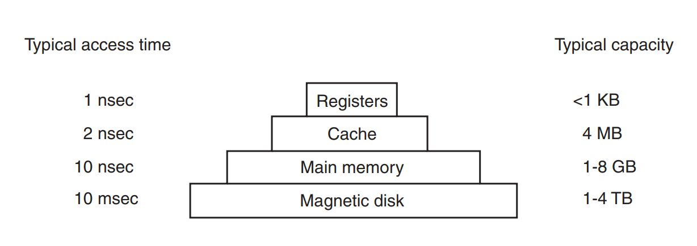
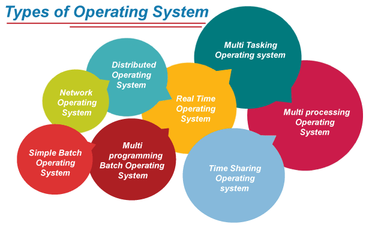

  <a href="https://www.linkedin.com/in/aminkhani-ai/" targert="_blacnk">
    
  
    
  
  

 

  <h1 align="center">Operating System (OS) Tutorial</h1>
  
  
 
     
   <a href="https://github.com/aminkhani/OS/issues/new?assignees=&labels=bug&template=bug_report.yml&title=%5BBUG%5D%3A+">🐛Report Bug</a>
   .
   <a href="https://github.com/aminkhani/OS/issues/new?assignees=&labels=question&template=question.yml&title=%5BQUESTION%5D%3A+">❓Ask Question</a>
   .
  <a href="https://github.com/aminkhani/OS/issues/new?assignees=&labels=like&template=like.yml&title=%5BLIKE%5D%3A+">👍Like the repo</a>
  .
  <a href="https://github.com/aminkhani/OS/issues/new?assignees=&labels=unlike&template=unlike.yml&title=%5BUNLIKE%5D%3A+">👎Dislike the repo</a>
  

  

 

> **Note**
>
> 📣 You can help to improve this repo, by giving me a **⭐star⭐** and **❤️following me❤️**

<h1 id="top">Contents</h1>
<ul>
    <li><a href="#why_os">Why Study Operating Systems (OS)?</a></li>    
    <li><a href="#os_definition">OS Definition and Function</a></li>
    <li><a href="#structure_os">Structure of a Computer System</a></li>
    <li><a href="#os_do">What Does an OS Do?</a></li>
    <li><a href="#his_os">History of OS</a></li>
    <li><a href="#basics_os">Basics of OS</a>
      <ul>
        <li><a href="#transistor">Trasistor</a></li>
        <li><a href="#ic">IC</a></li>
        <li><a href="#processor">Processor</a></li>
        <li><a href="#cpu">CPU</a></li>
        <li><a href="#microprocessor">Microprocessor</a></li>
      </ul>
    </li>
    <li><a href="#type_os">Types of OS</a>
      <ul>
        <li><a href="#batch_os">Batch OS</a></li>
        <li><a href="#multi_os">Multiprogramming OS</a></li>
        <li><a href="#multipro_os">Multiprocessing OS</a></li>
        <li><a href="#multitask_os">Multitasking OS</a></li>
        <li><a href="#net_os">Network OS</a></li> 
        <li><a href="#realtime_os">Real Time OS</a></li>  
        <li><a href="#time_os">Time-Sharing OS</a></li>     
        <li><a href="#distributed_os">Distributed OS</a></li>     
      </ul>
    </li>
</ul>

<h1 id="why_os">Why Study Operating Systems?</h1>

- **Modern computer** consists of one or more **processors**, some **main memory**, **disks**, **printers**, a **keyboard**, a **mouse**, a **display**, **network interfaces**, and various other **input/output devices**. All in all, a **complex system**. If every application programmer had to understand how all these things work in detail, no code would ever get written. Furthermore, managing all these components and using them optimally is an **exceedingly challenging job**. For this reason, computers are equipped with a layer of **software** called the **operating system**.
 

- Although there are many practitioners of computer science, only a small percentage of them will be involved in the creation or modification of an operating system.
 

- Simply because, as almost all code runs on top of an operating system, knowledge of how operating systems work is crucial to proper, efficient, effective, and secure programming. 
 

- Understanding the fundamentals of operating systems, how they drive computer hardware, and what they provide to applications is not only essential to those who program them but also highly useful to those who write programs on them and use them.

<h1 id="os_definition">Operating System Definition and Function</h1>

- In the **Computer System** (comprises of **Hardware** and **Software**), **Hardware** can only understand **machine code** (in the form of **0** and **1**) which doesn't make any sense to a naive user.
 

- We need a system which can act as an **intermediary** and manage all the **processes** and **resources** present in the system.
 

 

- An **Operating System** can be defined as an **interface between user and hardware**. It is **responsible** for the **execution** of all the **processes**, **Resource Allocation**, **CPU management**, **File Management** and many other tasks.
 

- The **purpose** of an operating system is to **provide an environment** in which a user can **execute programs** in **convenient and efficient manner**.

<h1 id="structure_os">Structure of a Computer System</h1>

- ### A Computer System consists of:
  - #### Users 
    - People who are using the computer.
  - #### Application Programs 
    - Compilers, Databases, Games, Video player, Browsers, etc.
  - #### System Programs 
    - Shells, Editors, Compilers, etc.
  - #### Operating System 
    - A special program which acts as an interface between user and hardware.
  - #### Hardware
    - CPU, Disks, Memory, I/O Devices ,etc.
 

 

<h1 id="os_do">What Does an Operating system Do?</h1>

#### 1. Process Management
#### 2. Process Synchronization
#### 3. Memory Management
#### 4. CPU Scheduling
#### 5. File Management
#### 6.Security

<h1 id="his_os">Operating Systems - History</h1>

- #### 1945 – 1955 : The First Generation, Vacuum Tubes and Plugboards

- #### 1955 – 1965 : The Second Generation, Transistors and Batch Systems

- #### 1965 - 1980 : The Third Generation, ICs and Multiprogramming
- #### 1980 - Present : The Fourth Generation, Personal Computers
- #### 1990 - Present : The Fifth Generation, Moblie Computets

<h1 id="basics_os">Basics of Operating System</h1>

- Some **basic knowledge of the structure of Computer System** is **required** to **understand how Operating System works**. 
 

- **Operating system** is intimately tied to the **hardware** of the computer it runs on. It **extends** the **computer’s instruction set** and **manages its resources**.
 

 

- The **CPU**, **memory**, and **I/O devices** are all connected by a **system bus** and communicate with one another over it

## 1. Transistor
- A **transistor** is a **[semiconductor device](https://en.wikipedia.org/wiki/Semiconductor_device)** used to **amplify** or **switch electrical signals** and **power**. 
 

- A **transistor** is a **binary switch** and the **fundamental building block** of **computer circuitry**.
  - The **transistor** either **prevents or allows** **current** to flow through.
 

- A **single modern CPU** can have **hundreds of millions** or even **billions** of **transistors**.

## 2. Integrated Circuit (IC)
- An **integrated circuit** or **monolithic integrated circuit** (also referred to as an **IC**, a **chip**, or a **microchip**) is a **set of electronic circuits** on one **small flat piece** (or **chip**) of **semiconductor material**, usually **silicon**.
 

- On which **thousands or millions of tiny** **resistors**, **capacitors**, **diodes** and **transistors** are fabricated.

## 3. Processor
- In **computing** and **computer science**, a **processor** or **processing unit** is an **electrical component (digital circuit)** that **performs operations** on an **external data source**, usually **memory** or some other data stream.
 

- It typically takes the form of a **microprocessor**. Today, processors use built-in transistors.
 

- Like a **soul in our body** keeps us alive so that the **processor** does in the computer.
- ### Moore's law:
  - **Moore's law**, named after **[Gordon Moore](https://en.wikipedia.org/wiki/Gordon_Moore)**, is the **observation** and **projection** via historical trend that the **number of transistors** in **integrated circuits (IC)**, and therefore processors by extension, **doubles every two years**. The progress of processors has followed Moore's law closely.

- ### Types of Processors:
  - **[CPU](#4-cpu-central-processing-unit)**
  - **[GPU]()**
  - **[TPU]()**
  - **[PPU]()**
  - **[SPE or SPU]()**

## 4. CPU (Central Processing Unit)
 

- The **brain** of the **computer** is the **CPU (Central Processing Unit)**. It **fetches instructions** from **memory** and **executes** them. 
   

- The basic **cycle** of every **CPU** is to **fetch** the **first instruction** from **memory**, **decode** it to **determine its type and operands**, **execute** it, and then **fetch**, **decode**, and **execute subsequent instructions**.
 

- The cycle is repeated **until** the **program finishes**. In this way, programs are **carried out**.
 

- All **CPUs contain** some **registers** inside to **hold key variables and temporary results**.
 

- Most computers have several special registers that are visible to the programmer. One of these is the **program counter (PC)**, which contains the **memory address of the next instruction** to be **fetched**.
 

- **Stack pointer (SP)**, which points to the **top of the current stack in memory**.
 

- **PSW (Program Status Word)**, this register contains the **condition code bits**, which are **set by comparison instructions**, the **CPU priority**, the **mode (user or kernel)**, and **various other control bits**.
 

- The **PSW** plays an **important role** in **system calls** and **I/O**.
 

- To **improve performance**, **CPU designers** have long **abandoned** the simple model of **fetching**, **decoding**, and **executing** **one instruction at a time**. Many **modern CPUs** have **facilities for executing** **more than one instruction** at the same time.
  - For example, a **CPU** might have **separate fetch**, **decode**, and **execute units**, Such an organization is called a **pipeline**.
 

 

- Even **more advanced than** a **pipeline design** is a **superscalar CPU**. In this design, **multiple execution units** are present
  - For example, one for integer arithmetic, one for floating-point arithmetic, and one for Boolean operations. Two or more instructions are fetched at once, decoded, and dumped into a holding buffer until they can be executed.
 

 

- A **processor** is any component that processes commands, reads, and writes data. A **CPU** is a **Central Processing Unit**, and the **main processor** in a computer.
  -  Many different computer components, like hard drives, have processors but the CPU is the most important processor in a computer and controls everything.
 

- **Central processing units (CPUs)** are the **primary processors** in most computers. They are designed to **handle a wide variety** of **general computing tasks** rather than only a few domain-specific tasks.
 

- The **CPU** is a **microprocessor**. The **microprocessor** is an **integrated circuit (IC)** that is **made up of millions of transistors**. However, not all **microprocessors are CPUs**. There are **NPUs**, **GPUs** and **APUs** that remove network, graphics or audio processing from the **CPU**. 
 

- The CPU is not slowed down by operations that can be done by outside microprocessors; and since all are working in conjunction, the results are displayed faster, more robustly and with less breakup or downtime.

## 5. Microprocessor
 

- A **microprocessor** is a **computer processor** where the **data processing logic** and **control** is included on a **single integrated circuit (IC)**, or a **small number of integrated circuits**.
 

- The **microprocessor** contains the **arithmetic**, **logic**, and **control circuitry** **required to perform the functions** of a **computer's central processing unit**.
 

- The **integrated circuit (IC)** is capable of **interpreting and executing program instructions** and performing arithmetic operations.
 

- Microprocessor is the latest form of processor or CPU. The microprocessor is a single-chip circuit integrated with all qualities of CPU with few new circuits. Its processing speed is greater than CPU. Today all latest processor CPUs are a microprocessor.

### Key Differences between Processor and Microprocessor

1. Processor or CPU is capable of performing all kinds of computing and arithmetic functions while microprocessor deals in BIOS & memory circuits in addition to performing all CPU functions.
 

2. Microprocessor functions are greater than the processor. In addition to processor qualities, some graphic processor units (GPU), sound cards and internet cards are also included in it.
 

3. Microprocessor is the latest and upgraded version of processor/CPU.
 

4. Although microprocessor is the latest and advanced technology but still the main processing function of the computer is controlled by the processor.
 

5. The new function of audio processing which helps in producing clear audio is stored in a sound card of the microprocessor which was previously not available in the processor.
 

6. Due to the addition of different processors on a microprocessor, its speed is slower than the processor.
 

7. CPUs/processors can be microprocessor but all microprocessors are not CPU.
 

8. CPU is the main part of the computer while the microprocessor is a simple chip on the motherboard.

## 6. Memory
  - The **second major component** in any computer is the **memory**.
   

  - The memory system is constructed as a hierarchy of layers.
   
  
   

  - The **top layer** consists of the **registers internal** to the CPU. They are made of the same material as the CPU and are thus just **as fast as the CPU**. Consequently, there is no delay in accessing them. The storage capacity available in them is typically 32 × 32 bits on a 32-bit CPU and 64 × 64 bits on a 64-bit CPU. Less than 1 KB in both cases. Programs must manage the registers (i.e., decide what to keep in them) themselves, in software.
   

  - **Cache memory**, which is mostly **controlled** by the **hardware**. **Main memory** is **divided up** into **cache lines**, typically **64 bytes**, with addresses 0 to 63 in cache line 0, 64 to 127 in cache line 1, and so on. The most heavily used cache lines are kept in a high-speed cache located inside or very close to the CPU. When the program needs to read a memory word, the cache hardware checks to see if the line needed is in the cache. If it is, called a **cache hit**.
    - **Cache hits** normally take about **two clock cycles**.
    

  - Cache memory is limited in size due to its high cost. Some machines have two or even three levels of cache, each one slower and bigger than the one before it.

  

<h1 id="type_os">Types of Operating Systems</h1>

- **Operating System** is a well-organized collection of programs that manages the computer hardware. It is a type of **system software** that is responsible for the smooth functioning of the computer system.
 

 

<h2 id="batch_os">Batch Operating System</h2>

- In the **1970s**, **Batch processing** was very popular. In this technique, **similar types of jobs** were **batched together** and executed in time.
 

- In **Batch operating system**, **access** is given to **more than one person**; they submit their respective jobs to the system for the execution.
 

- The system put all of the jobs in a **queue** on the basis of **first come**, **first serve** and then executes the jobs **one by one**. The users collect their respective output when **all the jobs** get executed.
 

 

- The **purpose** of this operating system was mainly to **transfer control** from one job to another as soon as the job was completed.

<h2 id="multi_os">Multiprogramming Operating System</h2>

- **Multiprogramming** is an **extension** to **batch processing** where the **CPU** is always **kept busy**. **Each process** needs two types of **system time**: 
  1. **CPU time**
  2. **IO time**
 

- In a **multiprogramming environment**, when a process does its I/O, The CPU can start the execution of other processes. Therefore, multiprogramming improves the efficiency of the system.
 

 

<h2 id="multipro_os">Multiprocessing Operating System</h2>

- In **Multiprocessing**, **Parallel computing** is achieved. There are **more than one processors**   present in the system which can execute more than one process at the same time. This will increase the throughput of the system.
 

 

 

<h2 id="multitask_os">Multitasking Operating System</h2>

- The **multitasking operating system** is a **logical extension of a multiprogramming system** that enables **multiple programs** simultaneously. It allows a user to perform more than one computer task at the same time.
 

 

 

<h2 id="net_os">Network Operating Systems</h2>

- An **Operating system**, which includes **software** and **associated protocols** to communicate with **other computers** via a **network** conveniently and cost-effectively, is called **Network Operating System**.
 

 

 

- In this type of operating system, **network traffic reduces** due to the **division between clients and the server**.
 

- This type of system is **less expensive** to **set up** and **maintain**.
 

- In this type of operating system, the **failure of any node** in a system affects the whole system.
 

- **Security and performance are important issues**. So trained network administrators are required for network administration.

<h2 id="realtime_os">Real Time Operating System</h2>

- In **Real-Time Systems**, each job **carries a certain deadline** within which the job is supposed to be **completed**, **otherwise**, the huge loss will be there, or even if the result is produced, it will be completely useless.
 

 

- The **Application of a Real-Time system** exists in the case of **military applications**, if you want to drop a missile, then the missile is supposed to be dropped with a certain precision.
 

 

- Easy to layout, develop and execute real-time applications under the real-time operating system.
 

- In a Real-time operating system, the maximum utilization of devices and systems.
 

- Real-time operating systems are very costly to develop.
 

- Real-time operating systems are very complex and can consume critical CPU cycles.

<h2 id="time_os">Time-Sharing Operating System</h2>

- In the **Time Sharing operating system**, computer resources are allocated in a time-dependent fashion to several programs simultaneously. Thus it helps to provide a large number of user's direct access to the main computer.
 

- It is a **logical extension of multiprogramming**. In time-sharing, the CPU is switched among multiple programs given by different users on a scheduled basis.
 

 

- A time-sharing operating system allows many users to be served simultaneously, so sophisticated CPU scheduling schemes and Input/output management are required.
 

- Time-sharing operating systems are very difficult and expensive to build.
 

- The time-sharing operating system provides effective utilization and sharing of resources.
 

- This system reduces CPU idle and response time.
 

- Data transmission rates are very high in comparison to other methods.
 

- Security and integrity of user programs loaded in memory and data need to be maintained as many users access the system at the same time.

<h2 id="distributed_os">Distributed Operating System</h2>

- The Distributed Operating system is not installed on a single machine, it is divided into parts, and these parts are loaded on different machines. A part of the distributed Operating system is installed on each machine to make their communication possible. Distributed Operating systems are much more complex, large, and sophisticated than Network operating systems because they also have to take care of varying networking protocols.
 

 

- The distributed operating system provides sharing of resources.
 

- This type of system is fault-tolerant.
 

- Protocol overhead can dominate computation cost.

